# The Daily Nexus

The Daily Nexus turns newsletters you explicitly label in Gmail into a private
podcast and a compact newspaper edition. Dario Novelli is the editor and
producer; Dalia and Nox can present the episode alone or together.

It includes:

- a Windows desktop application;
- an installable web app for desktop and iPhone;
- local Kokoro speech synthesis and FFmpeg audio processing;
- a private Apple Podcasts-compatible RSS feed;
- optional unattended generation with a private GitHub Actions runner and a
  timing-only Cloudflare Worker.

Each successful run produces a narrated MP3, a synchronized transcript, source
references, a reader-oriented PDF newspaper, preview images, metadata, and—when
publishing is enabled—an updated private RSS feed.

## How it works

```mermaid
flowchart LR
    A[Approved Gmail label] --> B[Newsletter bodies]
    B --> C[Safe public-article enrichment]
    C --> D[Antigravity editorial pipeline]
    R[Optional date research] --> D
    D --> E[Verified podcast script]
    D --> F[Independent newspaper edition]
    E --> G[Kokoro voices]
    G --> H[FFmpeg MP3 and transcript timing]
    F --> I[ReportLab PDF and PyMuPDF previews]
    H --> J[Local episode archive]
    I --> J
    J -. optional .-> K[Firebase private RSS and web app]
    L[Cloudflare timing-only clock] -. optional wake-up .-> M[Private GitHub Actions runner]
    M -. runs the same pipeline .-> A
```



The model writes and checks editorial structures; it does not synthesize the
voice. Kokoro generates speech, while the PDF renderer builds a separate
reader-facing edition rather than copying the spoken script. See the
[technical overview](docs/TECHNICAL_OVERVIEW.md) for the stages, boundaries,
technology choices, and current limitations.

## Read this first

This repository is a **public source template**. It contains no working account,
token, project ID, email address, private feed, newsletter, episode, or deployment.

For local-only use, you may clone it directly. For the web app, publishing, or
cloud automation, select **Use this template**, create a **new private repository**,
and work from that private copy. Do not use a public fork for a deployment and
never add credentials to this public template.

Each installation uses the operator's own Gmail, Google AI Pro/Antigravity,
Firebase, GitHub, and Cloudflare accounts. Repository secrets are not copied by
GitHub templates.

| Component | Needed for | Where private authorization lives |
| --- | --- | --- |
| Gmail read-only OAuth | Newsletter collection | Operating-system credential vault |
| Google AI Pro and Antigravity OAuth | Editorial generation and verification | Antigravity's operating-system keyring entry |
| Kokoro and FFmpeg | Local speech and audio processing | No account credential |
| Firebase Spark | Optional private web app, RSS, MP3, and PDF hosting | Local credential vault and private deployment settings |
| Private GitHub repository | Optional unattended Linux generation | Encrypted repository secrets |
| Cloudflare Free Worker | Optional schedule wake-up | Worker secrets; timing data only |

| Goal | Stop after |
| --- | --- |
| Generate and play locally | Local desktop setup |
| Add a private Apple feed | Firebase publishing setup |
| Use the authenticated web app | Firebase Authentication and Firestore setup |
| Generate while the PC is off | Private GitHub runner and Cloudflare clock setup |

You may stop after any stage; the later services are optional.

"Zero additional cost" means the design uses an existing Google AI Pro
subscription plus the no-billing/free tiers of the other services. Those tiers
have limits and can change. The application refuses known paid AI credentials,
requires Antigravity AI-credit fallback to be off, and is designed to stop at a
free-tier boundary rather than silently enable billing. Operators must still
verify the current [Firebase pricing](https://firebase.google.com/pricing),
[GitHub Actions billing](https://docs.github.com/en/billing/concepts/product-billing/github-actions),
and [Cloudflare Workers pricing](https://developers.cloudflare.com/workers/platform/pricing/)
before enabling automation. A spending budget is a guardrail, not a substitute
for reviewing provider billing settings.

## Fastest setup: local desktop app

### 1. Install prerequisites

On Windows 10 or 11, install:

- Python 3.11 or newer (3.12 recommended);
- Node.js 20 or newer;
- [uv](https://docs.astral.sh/uv/);
- [Antigravity CLI](https://www.antigravity.google/docs/cli/install/).

With Windows Package Manager:

```powershell
winget install --exact --id Python.Python.3.12
winget install --exact --id OpenJS.NodeJS.LTS
winget install --exact --id astral-sh.uv
```

Close and reopen PowerShell after installing prerequisites. Download or inspect
the Antigravity installer through Google's official documentation rather than
copying an installer command from an untrusted source.

### 2. Install The Daily Nexus

Put the clone in a permanent local folder, then open PowerShell there. The
desktop launcher uses that path; if you move the clone later, rerun setup.

```powershell
git clone YOUR_REPOSITORY_URL
Set-Location .\YOUR_REPOSITORY_NAME
```

Then install the application:

```powershell
Set-ExecutionPolicy -Scope Process Bypass
.\scripts\setup-windows.ps1 -InstallFfmpeg
```

This creates a private runtime under `%LOCALAPPDATA%\AudioDigest`, installs the
pinned Firebase command-line tool, creates the ignored `config.toml`, and builds
the desktop launcher. It does not install a scheduled task or background service.
`AudioDigest` is the project's historical internal package/runtime name; the
user-facing product is The Daily Nexus.

### 3. Prepare the Gmail label

1. Create a Gmail label, such as `AudioDigest/Source`.
2. Apply it only to newsletters you approve, preferably with exact-sender filters.
3. Inspect the label and make sure it contains no personal, confidential, or
   transactional mail.

Only messages with the exact configured label are read.

### 4. Create read-only Gmail authorization

1. Create a dedicated Google Cloud project with **no Cloud Billing**.
2. Enable only the Gmail API.
3. Configure the Google Auth consent screen for your account.
4. Request only `https://www.googleapis.com/auth/gmail.readonly`.
5. Create a **Desktop app** OAuth client and download its JSON file.
6. Save it outside the repository as:

   ```text
   %LOCALAPPDATA%\AudioDigest\secrets\client_secret.json
   ```

Do not place the OAuth file in Git, cloud storage, screenshots, or chat.

### 5. Authenticate and test

```powershell
.\scripts\authenticate.ps1
.\scripts\test.ps1
```

For Antigravity, choose **Google OAuth**, not a Google Cloud project. Sign in
with the account that owns Google AI Pro, finish onboarding, then enter `/quit`.
The Gmail read-only consent follows.

Before every model request the app verifies:

```json
{
  "useG1Credits": false,
  "enableTelemetry": false
}
```

The authentication helpers also set these privacy preferences in the user's
global Antigravity and Firebase CLI configuration, so the same opt-outs apply
outside this clone until the user changes them.

Open **The Daily Nexus**, run **Check setup**, and make the first episode a
local-only test. Generated files stay under
`%LOCALAPPDATA%\AudioDigest\episodes`.

For troubleshooting and more detail, see [the full desktop setup](docs/SETUP.md).

## Optional: private Apple Podcasts feed

The private feed uses static Firebase Hosting on the **Spark** plan. Its URL is
an unlisted bearer link: anyone who obtains the full URL can open it. Treat it
like a password.

In outline:

1. Create a dedicated Firebase project with Analytics off, Spark selected, and
   no linked Cloud Billing account.
2. Start static Hosting; do not enable Functions, App Hosting, Cloud Run,
   Storage, or Cloud Scheduler.
3. In the desktop app, configure the Firebase project and complete Firebase
   sign-in.
4. Manually recheck Spark and confirm that no Cloud Billing account is linked,
   then record that acknowledgement in the app. The app cannot inspect billing
   linkage for you.
5. Generate and review an episode locally.
6. Publish it manually and verify the MP3 and newspaper before enabling
   automatic publishing.
7. In Apple Podcasts, choose **Follow a Show by URL** and use the private feed
   address.

Follow the exact sequence in [private publishing setup](docs/PUBLISHING.md).

## Optional: private web app

The web console requires the same Firebase project. Complete these steps in the
new private deployment repository, never in this public template:

1. Enable Google in Firebase Authentication.
2. Create the Firestore **Standard edition** `(default)` database while remaining
   on Spark.
3. Create a second Desktop OAuth client for the unattended Firebase owner
   session. Keep it distinct from the Gmail client and store it at:

   ```text
   %LOCALAPPDATA%\AudioDigest\secrets\client_secret_web_runner.json
   ```

4. Put only your deployment values in the ignored `config.toml`:

   ```toml
   [web]
   enabled = true
   firebase_api_key = "YOUR_FIREBASE_WEB_API_KEY"
   owner_uid = "YOUR_FIREBASE_AUTH_UID"
   oauth_client_secret_path = "%LOCALAPPDATA%/AudioDigest/secrets/client_secret_web_runner.json"
   token_service = "TheDailyNexusWebRunner"
   token_username = "firebase-refresh-token"
   token_file_path = ""
   poll_minutes = 5
   ```

5. Authenticate the Firebase CLI, deploy the owner-only Firestore rules, and
   deploy the web shell. The cloud clock is optional at this stage:

   ```powershell
   .\scripts\authenticate-firebase.ps1

   & "$env:LOCALAPPDATA\AudioDigest\node-tools\node_modules\.bin\firebase.cmd" `
     deploy --only firestore:rules --project YOUR_FIREBASE_PROJECT_ID

   .\scripts\deploy-private-web-console.ps1 `
     -ProjectId YOUR_FIREBASE_PROJECT_ID
   ```

6. Open the new `web.app` address and sign in once. Firebase Authentication now
   lists that user and UID. In Firestore, add one document to the `owners`
   collection whose document ID is exactly that UID. A harmless field such as
   `active = true` is enough; do not store an email or name in the document.
7. Authenticate the unattended owner session, then reload the web app:

   ```powershell
   & "$env:LOCALAPPDATA\AudioDigest\venv\Scripts\python.exe" `
     -m audiodigest --config config.toml authenticate-web-runner
   ```

The browser uses session-only authentication and automatically signs out after
inactivity. Firestore rules authorize only the configured owner UID. Firebase
Authentication retains that owner's UID, email, and provider profile as part of
its normal authentication record; The Daily Nexus does not copy the email into
its Firestore documents.

See [the V4 architecture and setup](docs/V4_WEB_ARCHITECTURE.md).

## Optional: unattended private cloud generation

Cloud generation must run from the **private deployment repository**, never
from this public template. The included runner refuses to execute when GitHub
reports that its repository is public.

1. In GitHub billing settings, create an Actions budget of `$0` with
   **Stop usage when budget limit is reached**, and enable included-usage alerts.
2. Transfer the required grants with the included helper; it sends values to
   encrypted repository secrets through standard input and prints names only.
3. Perform an idle runner test, then one manually queued test.
4. On a Cloudflare Free account, deploy the timing-only Durable Object.
5. Give it a short-lived fine-grained GitHub token restricted to Actions on the
   single private deployment repository.
6. Test a schedule a few minutes ahead before enabling a daily schedule.

Rotate the Cloudflare dispatch token before its chosen expiry or automation will
stop. The runner is a GitHub-hosted Ubuntu job; it does not need a personal
computer to remain on. The Worker URL is public but its browser commands require
owner authentication. This release supports the standard `web.app` Hosting
origin and standard `workers.dev` endpoint, not custom domains.

The Cloudflare component stores timing and opaque schedule IDs only. Newsletter
content and generation credentials stay out of Cloudflare. GitHub receives them
only for a due private run and removes temporary copies after success or failure.

Use the detailed guides in this order:

1. [Private cloud runner](docs/CLOUD_RUNNER_SETUP.md)
2. [Cloudflare clock](docs/CLOUD_CLOCK_SETUP.md)
3. [Daily operations and recovery](docs/OPERATIONS.md)

## Privacy boundaries

The application deliberately separates the data paths:

```text
approved Gmail label
  -> newsletter text and allowed public pages
  -> isolated Antigravity request
  -> verified script + independent newspaper
  -> local Kokoro audio + local PDF rendering
  -> optional static private feed
```

- The Gmail OAuth grant is mailbox-wide read-only access. Application logic
  queries only the configured label. A trusted repository writer could modify a
  private workflow to misuse that read scope, so keep deployments single-owner
  or restrict write access rigorously.
- Antigravity receives the selected source text; generation is not offline.
- Raw newsletters, OAuth grants, scripts, local paths, and detailed errors are
  not published to Firebase.
- Apple/private-feed access is private by possession, not account authentication.
- Repository collaborators with write access can change workflows; grant access
  only to trusted operators.
- Disconnecting or deleting a repository does not automatically revoke grants at
  Google, GitHub, Firebase, or Cloudflare. Revoke them at the provider as well.

Read [privacy and cost controls](docs/PRIVACY_AND_COST.md) before enabling cloud
features and [SECURITY.md](SECURITY.md) before reporting a vulnerability.

## Cost guardrails

- Google AI Pro is an existing prerequisite; Antigravity credit fallback stays off.
- Firebase must remain on Spark with no billing account attached.
- GitHub Actions has finite included private minutes and must stop at the `$0` budget.
- Cloudflare must remain on Free with no paid add-ons.
- Kokoro, FFmpeg, ReportLab, and PyMuPDF run locally or on the private runner.
- Do not resolve a quota warning by adding a payment method or enabling billing.

## Development checks

```powershell
.\scripts\test.ps1
& "$env:LOCALAPPDATA\AudioDigest\venv\Scripts\python.exe" `
  .\scripts\audit-public-readiness.py --history
```

The public-readiness workflow repeats the source/history audit, lint, browser
syntax checks, Cloudflare tests, and Python tests on every push and pull request.
Maintainers should also follow the
[public release checklist](docs/PUBLIC_RELEASE_CHECKLIST.md); private deployment
history must never be merged into this repository.

For a verified component map and the exact eight-stage generation sequence, see
[TECHNICAL_OVERVIEW.md](docs/TECHNICAL_OVERVIEW.md).

## License and trademarks

Code and original project assets are provided under the [MIT License](LICENSE).
Third-party packages and brand assets retain their own terms; see
[THIRD_PARTY_NOTICES.md](THIRD_PARTY_NOTICES.md). The Daily Nexus and Dario
Novelli names may identify the project but do not imply endorsement by Google,
Apple, Firebase, GitHub, Cloudflare, or any newsletter publisher.
