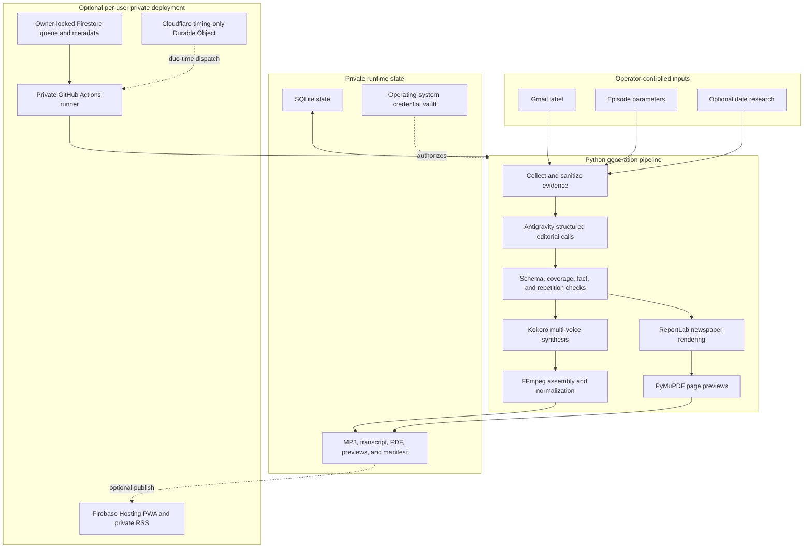

# Technical overview

The Daily Nexus is a privacy-oriented newsletter-to-podcast and
newsletter-to-newspaper pipeline. It can run manually on Windows or unattended
on an ephemeral Linux runner. The web application is a control, playback, and
reading surface; it does not perform model inference in the browser.

## System architecture

Every deployment belongs to one operator. Sharing the source means another
operator creates a separate private repository, credentials, Firebase project,
and Cloudflare Worker; it does not mean adding users to an existing production
deployment.

## The eight-stage generation run

| Stage | Process | Main output or control |
| --- | --- | --- |
| 1 | Query Gmail for the exact label and selected date; optionally load date-specific research | Approved newsletter bodies and evidence records |
| 2 | Decode supported tracking wrappers locally, reject utility links, enforce HTTPS/public-address checks, respect robots rules, and retrieve readable public pages | Newsletter-first evidence enriched with safe public text |
| 3 | Ask Antigravity for structured story extraction, classification, ranking, and duplicate consolidation | Evidence-linked story records |
| 4 | Generate the configured solo or two-host podcast script with ordered or content-derived sections | Structured host dialogue and show notes |
| 5 | Verify coverage and factual support; repair rejected drafts within bounded attempts | Approved spoken script |
| 6 | Generate and quality-check an independent reader-facing newspaper, targeting two pages with a third page allowed only for readable overflow | Structured newspaper JSON, PDF, and page previews |
| 7 | Synthesize each host locally with Kokoro, assemble segments, preserve transcript timing, and normalize the MP3 with FFmpeg | MP3 and timed transcript |
| 8 | Finalize locally or publish an incremental Firebase Hosting release, then fetch the remote RSS feed and verify the new episode | Local archive or remotely verified private feed |

Temporary source payloads are removed in the pipeline's cleanup path. A run is
not marked published merely because files were uploaded: remote RSS verification
must also succeed.

## What each intelligence component does

- **Antigravity CLI** handles structured editorial reasoning: story extraction,
  script drafting, script verification and repair, independent newspaper copy,
  and bounded newspaper quality review. Inputs are limited to selected evidence
  and explicit instructions. Responses must pass local schema and quality
  validation.
- **Kokoro** is the local neural text-to-speech engine. Host voice selection is
  separate from editorial tone. It receives approved dialogue, not Gmail OAuth
  credentials.
- **FFmpeg and ffprobe** assemble speech segments, normalize loudness, encode the
  MP3, and inspect duration. Playback speed adjustment uses FFmpeg so pitch can
  be preserved.
- **ReportLab and PyMuPDF** render the independent newspaper PDF and browser-ready
  page previews. The current renderer uses bundled project artwork and does not
  download external images.

## Application and infrastructure

| Area | Technology | Responsibility |
| --- | --- | --- |
| Core application | Python 3.11+ | Pipeline orchestration, validation, storage, publishing, and desktop UI |
| Gmail access | Google Gmail API and OAuth 2.0 | Mailbox-wide read-only grant; application query is restricted to the configured label |
| Editorial model access | Google Antigravity CLI with Google OAuth | Uses an existing Google AI Pro allowance; paid API keys and AI-credit fallback are rejected |
| Speech | Kokoro, PyTorch, Misaki, espeak-ng | Local or ephemeral-runner voice synthesis |
| Audio | FFmpeg and SoundFile | Assembly, encoding, loudness normalization, and playback transformations |
| Newspaper | ReportLab, Pillow, and PyMuPDF | PDF layout, bundled graphics, and page previews |
| Local state | SQLite and filesystem manifests | Run state, episode inventory, checksums, transcripts, and generated media |
| Desktop | Python Tkinter | Generation, preferences, playback, reading, authentication, and publishing controls |
| Web | HTML, CSS, and vanilla JavaScript PWA | Owner sign-in, queue/schedule controls, playback, transcript/references, and PDF reading |
| Private web data | Firebase Authentication, Firestore, and static Hosting | Owner authorization, minimal queue metadata, application shell, RSS, MP3, and PDF delivery |
| Automation | GitHub Actions on Ubuntu | Ephemeral generation using encrypted secrets and a one-hour job limit |
| Scheduling | Cloudflare Worker and SQLite-backed Durable Object alarms | Stores timing-only projections and dispatches the private workflow when due |
| Quality and security | unittest, Ruff, Gitleaks, CodeQL, and Dependabot | Regression, lint, secret-history, static-analysis, and dependency-alert checks |

## Privacy and security boundaries

- Gmail authorization uses the narrowest available Gmail read scope, but that
  scope is mailbox-wide. The application enforces the selected label in code;
  deployment repository write access must therefore remain tightly controlled.
- Gmail, Antigravity, Firebase, GitHub, and Cloudflare credentials never belong
  in source control. Local grants use operating-system credential storage;
  unattended grants use encrypted secrets in the operator's private repository.
- Antigravity calls require `useG1Credits=false` and
  `enableTelemetry=false`. Known paid model credentials, Vertex credentials,
  and Google service-account credentials cause startup to stop.
- Public article retrieval rejects non-HTTPS and non-public destinations,
  follows bounded redirects, limits response size and time, and treats an
  inaccessible article as optional enrichment rather than a reason to replace
  newsletter evidence.
- The web session uses session-only Firebase persistence and signs out after 15
  minutes of inactivity. Firestore authorization requires a matching owner UID.
- The Apple-compatible RSS address is a capability URL, not user authentication.
  Anyone who obtains it can fetch the feed, so it must be handled like a
  password and rotated after exposure.
- Cloudflare sees only schedule timing and opaque IDs. It never receives Gmail
  labels, newsletter text, episode settings, model credentials, or feed media.

## Adoption requirements and limitations

The local application currently targets Windows. The unattended runner targets
GitHub-hosted Ubuntu. Each operator needs their own Google AI Pro access,
read-only Gmail OAuth client, and explicitly labeled newsletters. Firebase,
GitHub Actions, and Cloudflare are optional and are required only for the web,
private-feed, or unattended features.

The project does not provide a shared hosted multi-user service, bypass
publisher access controls, read attachments, use login cookies to fetch
articles, or guarantee that third-party free-tier limits will never change. It
also does not make the private RSS feed cryptographically user-authenticated.
Operators must review provider plans, quotas, permissions, and terms before
deployment.

For adoption, follow [README.md](../README.md), then the detailed guides in
[SETUP.md](SETUP.md), [PUBLISHING.md](PUBLISHING.md),
[CLOUD_RUNNER_SETUP.md](CLOUD_RUNNER_SETUP.md), and
[CLOUD_CLOCK_SETUP.md](CLOUD_CLOCK_SETUP.md).
